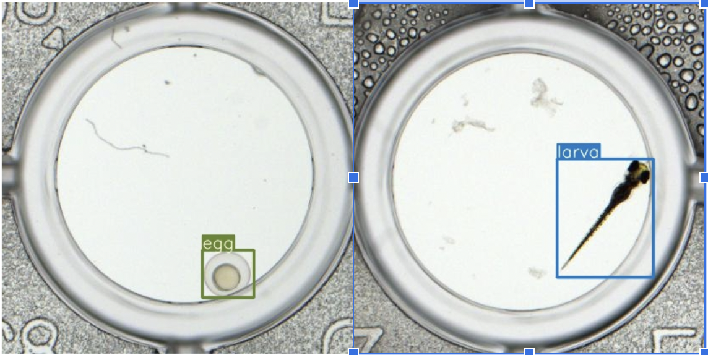
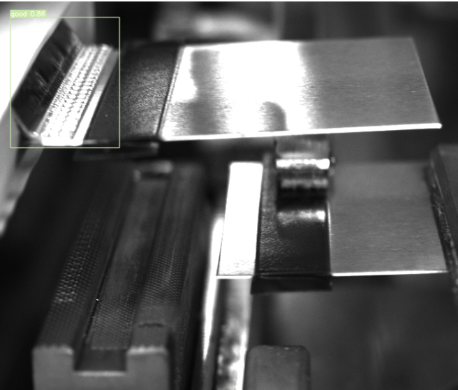

# Zebra AI Guide and Battery NG Detector Projects

## Introduction
This repository showcases two machine learning projects utilizing YOLOv7 for image detection tasks. One project focuses on the identification of zebras in images, while the other is dedicated to detecting defects in batteries.

## Zebra AI Guide (2023)
The Zebra AI project leverages YOLOv7 to analyze and detect zebras within a dataset of wildlife images. This project's goal is to enhance the accuracy of zebra detection which can be used for various applications such as wildlife tracking and population estimation.

## Huvio Battery NG Detector
The Battery NG Detector project aims to identify defects in battery images using YOLOv7. This is crucial for quality control in manufacturing processes. The project includes extensive data labeling, training, and analysis of the model performance on test images.

Both projects demonstrate the versatility and efficiency of YOLOv7 in handling different image detection challenges.

